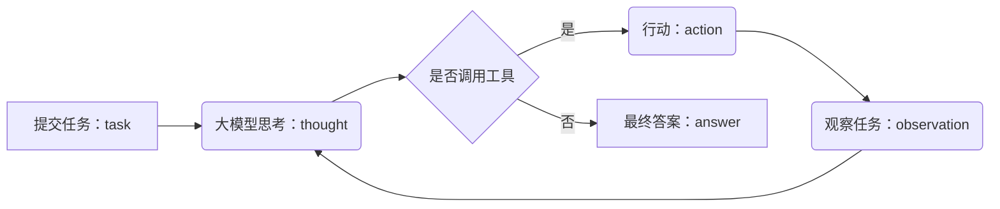

<!-- omit in toc -->
# `Agent`从入门到放弃

- [`ReAct`](#react)
- [代码](#代码)


`Agent`是近年来比较火的技术，但很多人（当然也包括我）对其概念比较模糊，遇事不决问`DeepSeek`，于是大模型回答如下：

> Agent在计算机科学和人工智能领域中，通常指一个能够感知环境、自主决策并执行动作以实现特定目标的实体。它就像一个虚拟的"代理人"或"智能体"，能在特定环境中独立工作。
>
> 简单来说，Agent 是能够独立思考和行动（ReAct）的智能程序，它不仅仅是被动响应指令，而是主动理解目标、规划步骤、调用工具、执行任务并学习优化。

听完这段话，估计你更迷糊了，什么叫感知环境？如何感知环境？什么是独立思考？如何自主决策和执行动作？

大模型相当于大脑，但这个世界就像人一样，光有脑子不够，只会在那里瞎BB，你得要能依靠手和脚才能干起来，那么什么才是`Agent`的手和脚呢，答案就是工具，毕竟人和动物的区别就是能利用工具😄。

那么，工具又是什么呢？在计算机领域，工具其实就是一个`函数`。使用工具就是调用对应的`函数`。接下来就是如何使用工具的问题。

> Google 团队在 2022 年的论文《ReAct: Synergizing Reasoning and Acting in Language Models》中提出`ReAct`, `ReAct` 是一种结合 “推理（Reasoning）” 与 “行动（Action）” 的 `Agent` 范式，核心思想是智能体在解决问题时，不仅需要内部推理（思考下一步该做什么），还需要通过外部行动（如调用工具、查询信息）获取反馈，通过交替进行 “思考” 和 “实际操作” 来解决复杂问题，两者循环迭代，最终达成目标。

## `ReAct`

一个典型的`Agent` 的 `ReAct` 流程如下所示：



要实现上述的`ReAct`流程，其核心就是提示词，毕竟大模型并不具备真正的智能，跟着用户提示词一起发送给大模型的系统提示词应该包括如下信息：

- 模型角色
- 运行规则
- 环境信息

上述提示词要准确描述模型的职责和工作流程，示范如下,引用[马克的技术工作坊](https://space.bilibili.com/1815948385?spm_id_from=333.337.0.0)：

```text
你需要解决一个问题。为此，你需要将问题分解为多个步骤。对于每个步骤，首先使用 <thought> 思考要做什么，然后使用可用工具之一决定一个 <action>。接着，你将根据你的行动从环境/工具中收到一个 <observation>。持续这个思考和行动的过程，直到你有足够的信息来提供 <final_answer>。

所有步骤请严格使用以下 XML 标签格式输出：
- <question> 用户问题
- <thought> 思考
- <action> 采取的工具操作
- <observation> 工具或环境返回的结果
- <final_answer> 最终答案

⸻

例子 1:

<question>埃菲尔铁塔有多高？</question>
<thought>我需要找到埃菲尔铁塔的高度。可以使用搜索工具。</thought>
<action>get_height("埃菲尔铁塔")</action>
<observation>埃菲尔铁塔的高度约为330米（包含天线）。</observation>
<thought>搜索结果显示了高度。我已经得到答案了。</thought>
<final_answer>埃菲尔铁塔的高度约为330米。</final_answer>

⸻

例子 2:

<question>帮我找一个简单的番茄炒蛋食谱，并看看家里的冰箱里有没有西红柿。</question>
<thought>这个任务分两步。第一步，找到番茄炒蛋的食谱。第二步，检查冰箱里是否有西红柿。我先用 find_recipe 工具找食谱。</thought>
<action>find_recipe(dish="番茄炒蛋")</action>
<observation>简单的番茄炒蛋食谱：将2个鸡蛋打散，2个番茄切块。热油，先炒鸡蛋，盛出。再热油，炒番茄至软烂，加入鸡蛋，放盐调味即可。</observation>
<thought>好的，我已经有食谱了。食谱需要西红柿。现在我需要用 check_fridge 工具看看冰箱里有没有西红柿。</thought>
<action>check_fridge(item="西红柿")</action>
<observation>冰箱检查结果：有3个西红柿。</observation>
<thought>我找到了食谱，并且确认了冰箱里有西红柿。可以回答问题了。</thought>
<final_answer>简单的番茄炒蛋食谱是：鸡蛋打散，番茄切块。先炒鸡蛋，再炒番茄，混合后加盐调味。冰箱里有3个西红柿。</final_answer>

⸻

请严格遵守：
- 你每次回答都必须包括两个标签，第一个是 <thought>，第二个是 <action> 或 <final_answer>
- 输出 <action> 后立即停止生成，等待真实的 <observation>，擅自生成 <observation> 将导致错误
- 如果 <action> 中的某个工具参数有多行的话，请使用 \n 来表示，如：<action>write_to_file("E:/ReAct/tmp/test.txt", "a\nb\nc")</action>
- 工具参数中的文件路径请使用绝对路径，不要只给出一个文件名。比如要写 write_to_file("E:/ReAct/tmp/test.txt", "内容")，而不是 write_to_file("test.txt", "内容")

⸻

本次任务可用工具：
${tool_list}

⸻

环境信息：

操作系统：${operating_system}
当前目录下文件列表：${file_list}
```

## 代码

要实现一个`Agent`，只需要使用代码把整个流程和`tools`整合起来即可。
代码同样来自[马克的技术工作坊](https://github.com/MarkTechStation)。相对比较简单，就是判断模型的返回，如果是需要调用工具，就使用调用工具的函数，并将工具返回数据给大模型接着下一轮大模型调用，直至大模型返回最终结果。

```python
class ReActAgent:
    def __init__(self, tools: List[Callable], model: str, project_directory: str):
        self.tools = { func.__name__: func for func in tools }
        self.model = model
        self.project_directory = project_directory
        self.client = OpenAI(
            base_url="https://openrouter.ai/api/v1",
            api_key=ReActAgent.get_api_key(),
        )

    def run(self, user_input: str):
        messages = [
            {"role": "system", "content": self.render_system_prompt(react_system_prompt_template)},
            {"role": "user", "content": f"<question>{user_input}</question>"}
        ]

        while True:

            # 请求模型
            content = self.call_model(messages)

            # 检测 Thought
            thought_match = re.search(r"<thought>(.*?)</thought>", content, re.DOTALL)
            if thought_match:
                thought = thought_match.group(1)
                print(f"\n\n💭 Thought: {thought}")

            # 检测模型是否输出 Final Answer，如果是的话，直接返回
            if "<final_answer>" in content:
                final_answer = re.search(r"<final_answer>(.*?)</final_answer>", content, re.DOTALL)
                return final_answer.group(1)

            # 检测 Action
            action_match = re.search(r"<action>(.*?)</action>", content, re.DOTALL)
            if not action_match:
                raise RuntimeError("模型未输出 <action>")
            action = action_match.group(1)
            tool_name, args = self.parse_action(action)

            print(f"\n\n🔧 Action: {tool_name}({', '.join(args)})")
            # 只有终端命令才需要询问用户，其他的工具直接执行
            should_continue = input(f"\n\n是否继续？（Y/N）") if tool_name == "run_terminal_command" else "y"
            if should_continue.lower() != 'y':
                print("\n\n操作已取消。")
                return "操作被用户取消"

            try:
                observation = self.tools[tool_name](*args)
            except Exception as e:
                observation = f"工具执行错误：{str(e)}"
            print(f"\n\n🔍 Observation：{observation}")
            obs_msg = f"<observation>{observation}</observation>"
            messages.append({"role": "user", "content": obs_msg})


    def get_tool_list(self) -> str:
        """生成工具列表字符串，包含函数签名和简要说明"""
        tool_descriptions = []
        for func in self.tools.values():
            name = func.__name__
            signature = str(inspect.signature(func))
            doc = inspect.getdoc(func)
            tool_descriptions.append(f"- {name}{signature}: {doc}")
        return "\n".join(tool_descriptions)

    def render_system_prompt(self, system_prompt_template: str) -> str:
        """渲染系统提示模板，替换变量"""
        tool_list = self.get_tool_list()
        file_list = ", ".join(
            os.path.abspath(os.path.join(self.project_directory, f))
            for f in os.listdir(self.project_directory)
        )
        return Template(system_prompt_template).substitute(
            operating_system=self.get_operating_system_name(),
            tool_list=tool_list,
            file_list=file_list
        )

    @staticmethod
    def get_api_key() -> str:
        """Load the API key from an environment variable."""
        load_dotenv()
        api_key = os.getenv("OPENROUTER_API_KEY")
        if not api_key:
            raise ValueError("未找到 OPENROUTER_API_KEY 环境变量，请在 .env 文件中设置。")
        return api_key

    def call_model(self, messages):
        print("\n\n正在请求模型，请稍等...")
        response = self.client.chat.completions.create(
            model=self.model,
            messages=messages,
        )
        content = response.choices[0].message.content
        messages.append({"role": "assistant", "content": content})
        return content

    def parse_action(self, code_str: str) -> Tuple[str, List[str]]:
        match = re.match(r'(\w+)\((.*)\)', code_str, re.DOTALL)
        if not match:
            raise ValueError("Invalid function call syntax")

        func_name = match.group(1)
        args_str = match.group(2).strip()

        # 手动解析参数，特别处理包含多行内容的字符串
        args = []
        current_arg = ""
        in_string = False
        string_char = None
        i = 0
        paren_depth = 0
        
        while i < len(args_str):
            char = args_str[i]
            
            if not in_string:
                if char in ['"', "'"]:
                    in_string = True
                    string_char = char
                    current_arg += char
                elif char == '(':
                    paren_depth += 1
                    current_arg += char
                elif char == ')':
                    paren_depth -= 1
                    current_arg += char
                elif char == ',' and paren_depth == 0:
                    # 遇到顶层逗号，结束当前参数
                    args.append(self._parse_single_arg(current_arg.strip()))
                    current_arg = ""
                else:
                    current_arg += char
            else:
                current_arg += char
                if char == string_char and (i == 0 or args_str[i-1] != '\\'):
                    in_string = False
                    string_char = None
            
            i += 1
        
        # 添加最后一个参数
        if current_arg.strip():
            args.append(self._parse_single_arg(current_arg.strip()))
        
        return func_name, args
    
    def _parse_single_arg(self, arg_str: str):
        """解析单个参数"""
        arg_str = arg_str.strip()
        
        # 如果是字符串字面量
        if (arg_str.startswith('"') and arg_str.endswith('"')) or \
           (arg_str.startswith("'") and arg_str.endswith("'")):
            # 移除外层引号并处理转义字符
            inner_str = arg_str[1:-1]
            # 处理常见的转义字符
            inner_str = inner_str.replace('\\"', '"').replace("\\'", "'")
            inner_str = inner_str.replace('\\n', '\n').replace('\\t', '\t')
            inner_str = inner_str.replace('\\r', '\r').replace('\\\\', '\\')
            return inner_str
        
        # 尝试使用 ast.literal_eval 解析其他类型
        try:
            return ast.literal_eval(arg_str)
        except (SyntaxError, ValueError):
            # 如果解析失败，返回原始字符串
            return arg_str

    def get_operating_system_name(self):
        os_map = {
            "Darwin": "macOS",
            "Windows": "Windows",
            "Linux": "Linux"
        }

        return os_map.get(platform.system(), "Unknown")
    def read_file(file_path):
    """用于读取文件内容"""
    with open(file_path, "r", encoding="utf-8") as f:
        return f.read()


def write_to_file(file_path, content):
    """将指定内容写入指定文件"""
    with open(file_path, "w", encoding="utf-8") as f:
        f.write(content.replace("\\n", "\n"))
    return "写入成功"

def run_terminal_command(command):
    """用于执行终端命令"""
    import subprocess
    run_result = subprocess.run(command, shell=True, capture_output=True, text=True)
    return "执行成功" if run_result.returncode == 0 else run_result.stderr

@click.command()
@click.argument('project_directory',
                type=click.Path(exists=True, file_okay=False, dir_okay=True))
def main(project_directory):
    project_dir = os.path.abspath(project_directory)

    tools = [read_file, write_to_file, run_terminal_command]
    agent = ReActAgent(tools=tools, model="openai/gpt-4o", project_directory=project_dir)

    task = input("请输入任务：")

    final_answer = agent.run(task)

    print(f"\n\n✅ Final Answer：{final_answer}")

if __name__ == "__main__":
    main()
```

这个例子很好的演示了`Agent`的运行过程，实际上如果我们使用AI平台，如`dify`，和上述的例子基本一致：


