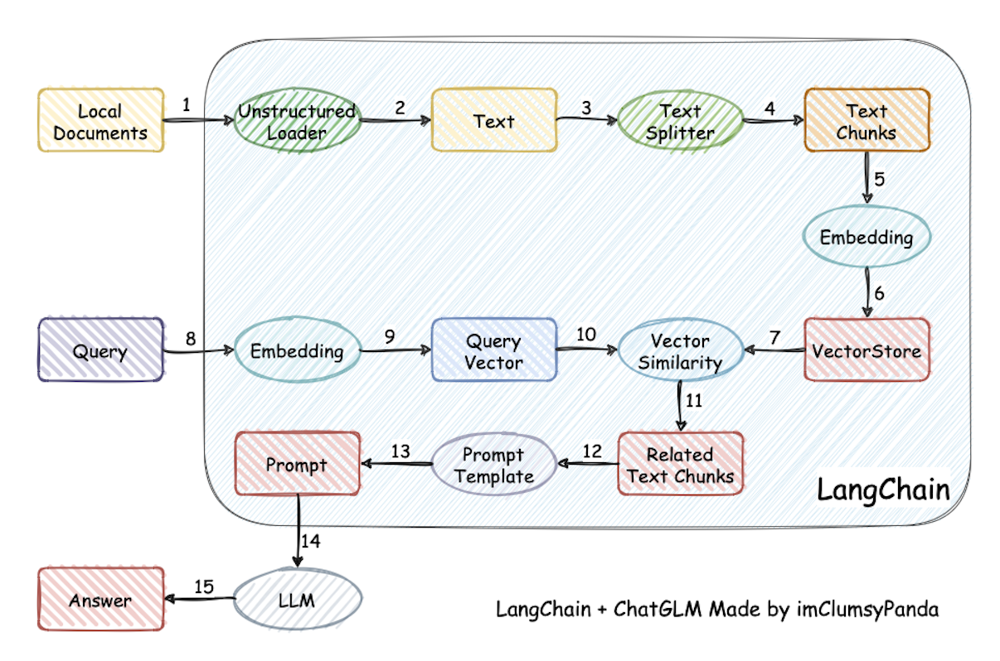
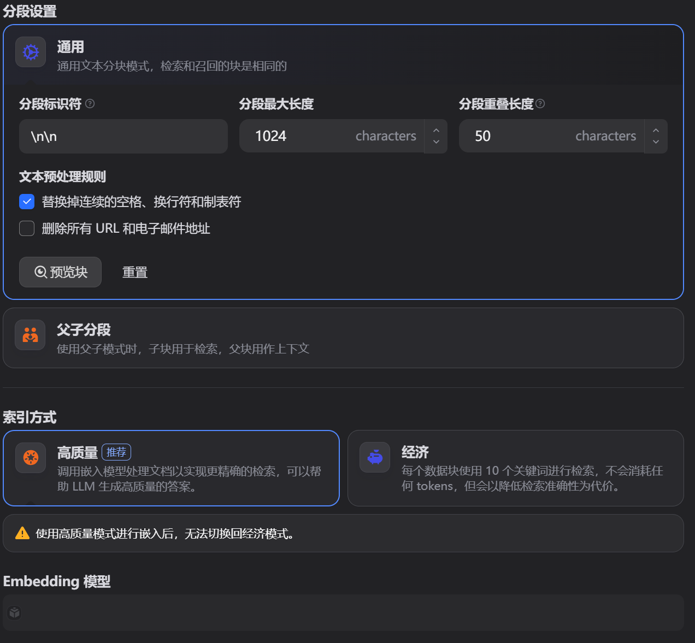
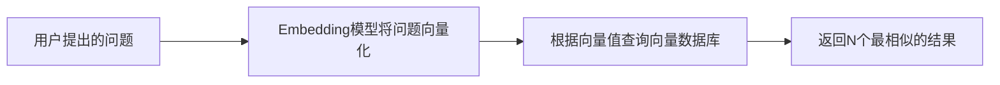
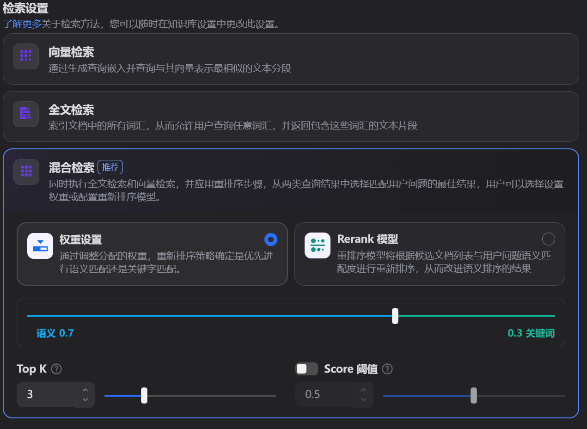

# `RAG`快速入门

`RAG`的全称是`Retrieval-Augmented Generation`，即检索增强生成，是一种将大规模语言模型（`LLM`）与外部知识源的检索相结合，以改进问答能力的工程框架。它通过检索外部知识库中的相关信息来辅助文本生成，从而弥补 `LLM` 在知识时效性、准确性等方面的局限性。
从上可以得知，`RAG`就干两件事情：

- 先从资料库中`检索`查询问题相关的内容
- 再基于查询的结果使用大模型`生成`最终的答案

一般用于`企业内部的AI问答`、`智能客服`等都是使用该技术实现。

## 总体框架

参考[动手学大模型应用开发](https://datawhalechina.github.io/llm-universe/#/C1/C1?id=_11-%e5%a4%a7%e5%9e%8b%e8%af%ad%e8%a8%80%e6%a8%a1%e5%9e%8b%ef%bc%88llm%ef%bc%89%e7%ae%80%e4%bb%8b)，`RAG`应用建构流程如下：



要做`RAG`，首先要准备检索数据，检索数据不是一整个文档，那样的话太大，大模型处理整个文档会很慢，消耗也巨大，所以要首先要将文档切分为多个片段，并建立索引，以便后续快速查询。

### 提问前的知识准备

- 分片
  - 将一个文档分成多个片段
  - 分片方式：可按字数、段落、章节、页面等方式
- 索引
  - 通过`Embedding`将片段文本转换为向量
  - 将片段文本和向量保存到向量数据库中

**选择哪个`Embedding`模型可以参考[这里](https://huggingface.co/spaces/mteb/leaderboard)。**
选择基于如下几个参数：

- 分片大小，因为`Embedding`模型要将整个分片转化为一个向量
- 文档的类型：文档的领域、指定的语言等信息



### 提问后的回答

- 召回：使用`向量相似度算法`找到与问题最相近的片段，流程如下：



计算向量相似度有多种方法：如余弦相似度、欧氏距离、点积等方法。向量相似度计算成本比较低，但准确度一般也不高，适合初步筛选。

- 重排：就是从`召回`的结果中找到最相关的片段，使用`Rerank`模型（如`cross-encoder`）计算与问题的相似度，计算成本和正确性都较高，适合精挑细选。
- 生成：就是将用户问题和经过召回重排查询出来的参考信息交给大模型，大模型就能给出比较准确的答案。



## 代码

依赖：

- sentence_transformers: 加载`enbedding`和`cross-encoder`模型
- chromadb: 向量数据库
- openai:大模型API
- python-dotenv：环境变量加载

代码比较简单，就是按照上面框架的简单实现。

```python
class RAG:
    def __init__(self):
        # embedding 和 rerank 模型
        self.embedding_model = SentenceTransformer('shibing624/text2vec-base-chinese')
        self.rerank_model = CrossEncoder('cross-encoder/mmarco-mMiniLMv2-L12-H384-v1')
        # 使用 智谱BigModel开放平台 大模型
        self.llm_model = OpenAI(api_key=RAG.get_api_key(),base_url="https://open.bigmodel.cn/api/paas/v4/")
        # 创建一个内存向量数据库
        self.chromadb_ = chromadb.EphemeralClient().get_or_create_collection(name='default')

    # 读取文件分割成多个块计算块的向量值并保存到向量数据库
    def load_file_to_chromadb(self, file: str) -> None:
        chunks = self.__split_chunks(file)
        embeddings = [self.__embed_chunk(chunk) for chunk in chunks]
        for i, (chunk, embedding) in enumerate(zip(chunks, embeddings)):
            self.chromadb_.add(
                documents=[chunk],
                embeddings=[embedding],
                ids=[str(i)]
            )

    def query_and_answer(self, query: str) -> str:
        retrieve_content = self.__retrieve(query)
        rerank_content = self.__rerank(query, retrieve_content)
        return self.__generate(query, rerank_content)

    def __retrieve(self, query:str, topk:int=5) -> List[str]:
        query_embedding = self.__embed_chunk(query)
        results = self.chromadb_.query(
            query_embeddings=[query_embedding],
            n_results=topk
        )['documents']
        if results:
            return results[0]
        else:
            raise ValueError(f"未找到 {query} 相似的数据")

    def __embed_chunk(self, chunk: str) -> List[float]:
        return self.embedding_model.encode(chunk, normalize_embeddings=True).tolist()

    def __rerank(self, query: str, retrieve_chunks: List[str], topk:int=3) -> List[str]:
        pairs = [(query, chunk) for chunk in retrieve_chunks]
        scores = self.rerank_model.predict(pairs)
        scored_chunks = list(zip(retrieve_chunks, scores))
        scored_chunks.sort(key=lambda x: x[1], reverse=True)
        return [chunk for chunk, _ in scored_chunks][:topk]

    def __generate(self, query: str, chunks: List[str]) -> str:
        prompt = f"""用户问题：{query}

        相关片段：{"\n\n".join(chunks)}

        请基于上述内容作答，不要编造信息。
        """
        response = self.llm_model.chat.completions.create(
            model="glm-4-flash",  # 模型名称（智谱的 GLM-4.5-Flash 对应此名称）
            messages=[
                {"role": "system", "content": "你是一位电力行业的专家，请根据用户的问题和下列片段生成准确的问答。"},
                {"role": "user", "content": prompt}
            ],
            temperature=0.3,  # 控制输出随机性（0-1，值越高越随机）
            max_tokens=1024  # 最大生成 tokens 数
        )
        # 提取生成的内容
        if response.choices[0].message.content:
            return response.choices[0].message.content 
        return '模型返回错误，暂时无法提供服务'

    # 读取文件并使用换行符分割成多个块
    def __split_chunks(self, file: str) -> List[str]:
        with open(file, encoding="utf-8") as f:
            content = f.read()
        return [chunk for chunk in content.split("\n\n")]
```
